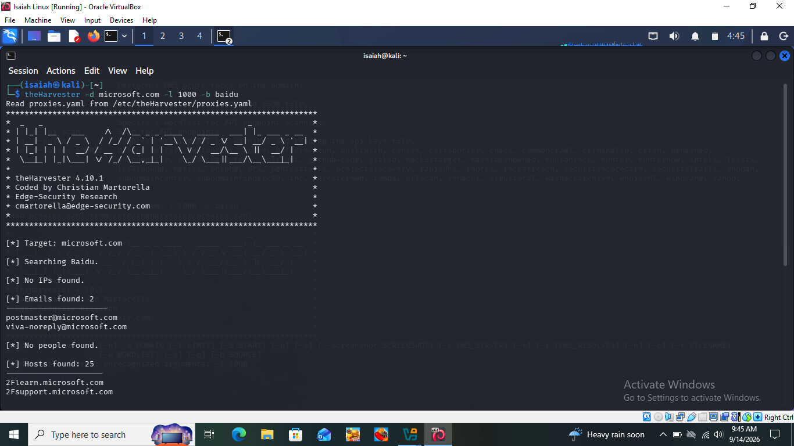
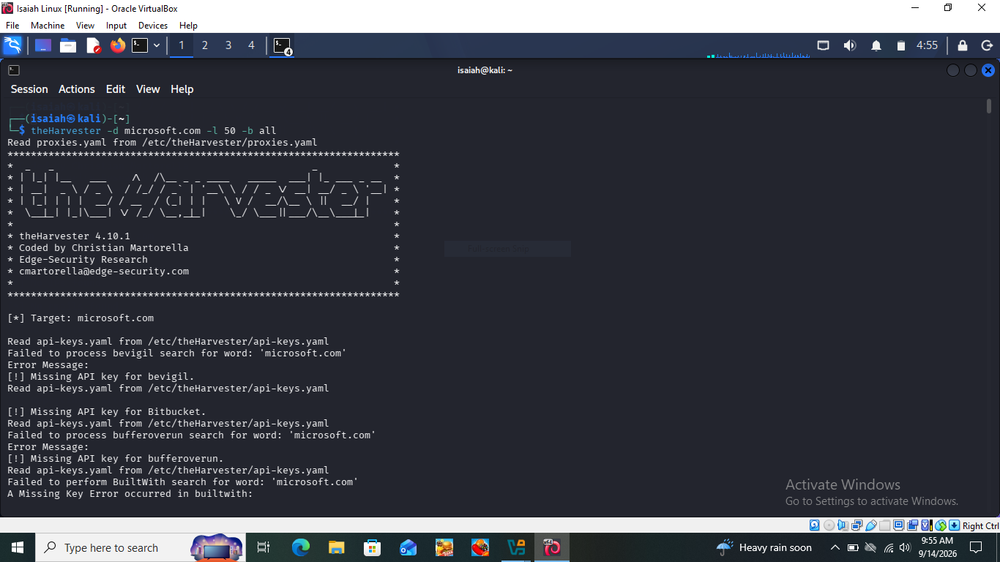
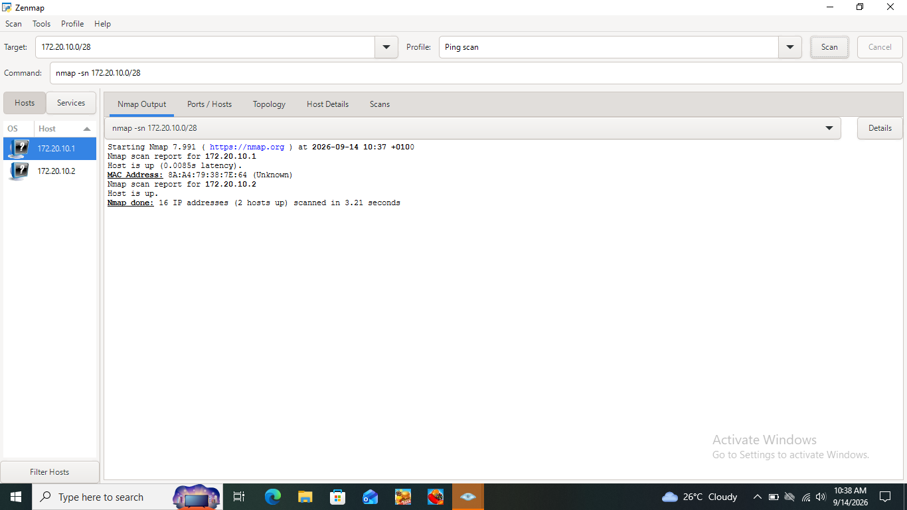
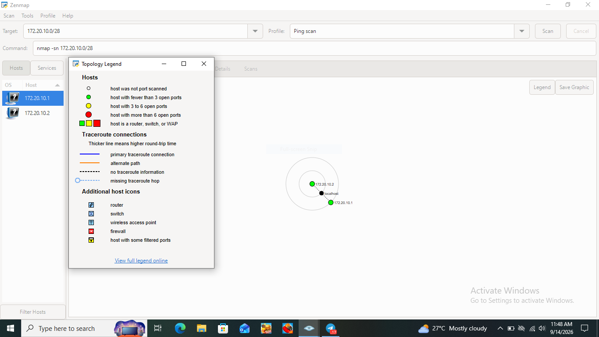
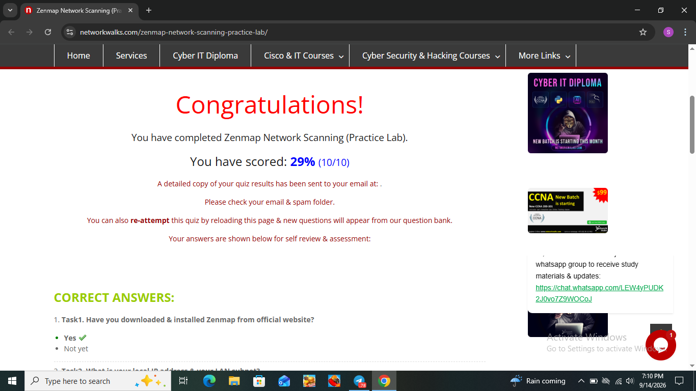

# Footprinting and Network Scanning — Week 2

A hands-on internship project covering OSINT footprinting with theHarvester and local network discovery with Zenmap

        

## 📌 About This Project
This project documents two practical exercises completed during Week 2 of my Cybersecurity internship at Networkwalks: footprinting the microsoft.com domain using theHarvester in Kali Linux, and scanning my own local network using Zenmap on Windows.

Footprinting focuses on gathering public information about a target without touching it directly, while network scanning focuses on discovering live devices on a network I control. Together these two exercises represent the early reconnaissance and discovery phases that come before any deeper security testing.

## 🛡️ Liability Disclaimer
I carried out these activities only on systems I own or where I had explicit permission, and only against public information sources for the footprinting exercise. These materials are for educational purposes only. I understand that unauthorized access or misuse of these techniques against systems I do not own or have permission to test is illegal, and that every action taken with this knowledge is my own responsibility.

## 🔧 Tools Used
| Tool | Purpose |
|---|---|
| Kali Linux | Operating system used to run theHarvester for reconnaissance |
| theHarvester | Gather emails, subdomains and hosts related to a target domain from public sources |
| Windows 10 | Host operating system used to run Zenmap for network scanning |
| Zenmap (Nmap GUI) | Scan the local subnet to find live hosts, their IP addresses and MAC addresses |
| ipconfig | Identify local IP address, subnet mask and default gateway on Windows |

## 🎯 Activities Performed

### 4.1 Footprinting with theHarvester

I used theHarvester in Kali Linux to gather publicly available email addresses and subdomains linked to microsoft.com. This tool works by passively querying public sources rather than contacting the target directly, making it a low risk first step in reconnaissance.

**Task 1 — Baidu source, limit 1000:**
Returned 2 emails (postmaster@microsoft.com and viva-noreply@microsoft.com) and 25 hosts, including subdomains such as learn.microsoft.com and support.microsoft.com.

*Task 1: theHarvester scan of microsoft.com using Baidu as the source*

**Task 2 — All sources, limit 50:**
Several sources returned "Missing API key" errors since those require paid access I don't have. This is expected behavior — theHarvester simply skips those and still returns results from free sources.

*Task 2: theHarvester scan of microsoft.com using all available sources*

### 4.2 Network Scanning with Zenmap

I used Zenmap to discover live hosts on my own local network. I was connected through my phone's personal hotspot rather than a home router, which meant my network used a smaller address range than the standard example given in the practical.

**Step 1 — Find local IP and subnet:**

*Local IPv4 address, subnet mask and default gateway*

My Wi-Fi adapter showed IPv4 address **172.20.10.2** with subnet mask **255.255.255.240**. Unlike the standard 255.255.255.0 mask, this meant my network only had 16 possible addresses (a /28 network) rather than 256. I adjusted my scan target accordingly:

*Live hosts discovered on my network*

**Results — 2 live hosts found:**
- 172.20.10.1 — mobile hotspot gateway, MAC address 8A:A4:79:38:7E:64
- 172.20.10.2 — my own laptop, MAC address 2E-38-27-78-54-D4 (found using `ipconfig /all`)

After completing the scan, I opened the Topology tab, enabled the legend, and exported the diagram as a PDF file.

*Topology legend reviewed before exporting the diagram*

📄 Full topology diagram: [Zenmap_Topology.pdf](Zenmap_Topology.pdf)

### 4.3 Lab Assessment

I also completed the official practice lab quiz on Networkwalks' site to confirm my task answers.

*Completed Zenmap Network Scanning practice lab quiz*

## 🔍 Risk Analysis and Impact
| # | Finding | Evidence | Potential Impact |
|---|---|---|---|
| 1 | Public email addresses discoverable | theHarvester found 2 working email addresses linked to microsoft.com | Could be used as targets for phishing or social engineering attempts |
| 2 | Numerous subdomains discoverable | theHarvester found 25 hosts/subdomains under microsoft.com | Each subdomain is a potential additional entry point |
| 3 | Some OSINT sources require paid API access | Several sources in the all sources scan returned missing API key errors | A well resourced attacker with paid API access could gather more complete results |
| 4 | Live hosts discoverable on local network | Zenmap identified 2 live hosts on my hotspot network | On a larger or shared network, this reveals every reachable device to an attacker |

These findings are observations from reconnaissance and discovery activities, not confirmed vulnerabilities. No exploitation was attempted or required for either module.

## 🐛 Problems Faced & Solutions

### Problem 1: theHarvester command deprecated
When I tried running my second theHarvester command, I got a message saying the capitalized `theHarvester` command was deprecated in favor of `theharvester` (all lowercase).

**Fix:** Switched to the lowercase `theharvester` command going forward. Both versions work the same way, it was just a naming update in the newer tool version.

### Problem 2: First scan results not saved
My very first theHarvester run wasn't saved to a file, so once the terminal output scrolled past, I lost that evidence and had to run the command again.

**Fix:** Re-ran the command using the `-f` flag to save results directly to a file, e.g. `theharvester -d microsoft.com -l 1000 -b baidu -f task1_baidu_results`. This saves the output as both XML and JSON, so it's always available afterward, screenshot or not.

### Problem 3: Non-standard subnet on my network
The practical example assumed a typical home network subnet mask of 255.255.255.0 (a /24 network with 256 addresses). My actual network, connected through a mobile hotspot, used 255.255.255.240 instead (a /28 network with only 16 addresses).

**Fix:** Ran `ipconfig` first to check my actual subnet mask rather than assuming it matched the example, then calculated the correct scan range as 172.20.10.0/28 instead of copying the /24 range from the practical. This ensured my scan covered the correct address space instead of a much larger, inaccurate one.

## 💡 Recommendations
- Be selective about which email addresses are made public, since harvested emails can become phishing targets
- Regularly review which subdomains are publicly resolvable and retire any no longer needed
- Treat any OSINT footprinting exercise as a reminder to check what information about your own organization is publicly discoverable
- Periodically scan your own network to confirm only expected devices are connected
- Always perform reconnaissance and scanning only against systems you own or have explicit authorization to test

## 🎓 Conclusion
During Week 2 of my Cybersecurity internship, I completed two practical exercises covering footprinting and network scanning. In the footprinting activity, I used theHarvester to gather public information about microsoft.com, learning how different data sources return different results and why some require paid API access.

In the network scanning activity, I used Zenmap to identify my local network configuration and discover live hosts. This exercise also taught me an important lesson about subnet sizing: because I was connected via a mobile hotspot with a /28 subnet mask instead of the more common /24, I had to calculate the correct scan range myself rather than simply copying the example given in the practical.

Both exercises reinforced that reconnaissance is a critical early step in cybersecurity work, and that documenting findings clearly, including unexpected results like a non-standard subnet, is just as important as running the tools correctly. All activities were completed within an authorized, educational scope.

## 👤 Author
Salifu Isaiah
Cybersecurity Intern B083
LinkedIn: [linkedin.com/in/salifu-isaiah](https://www.linkedin.com/in/salifu-isaiah/)
GitHub: [github.com/CyberIsaiah](https://github.com/CyberIsaiah)

## 📌 Project Information
Program Name: Cybersecurity Program at Networkwalks | Week: 02 | Repository: GitHub
